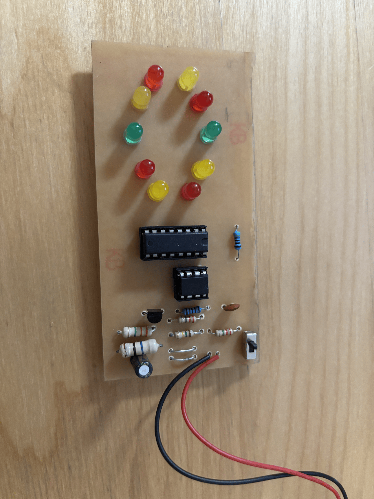
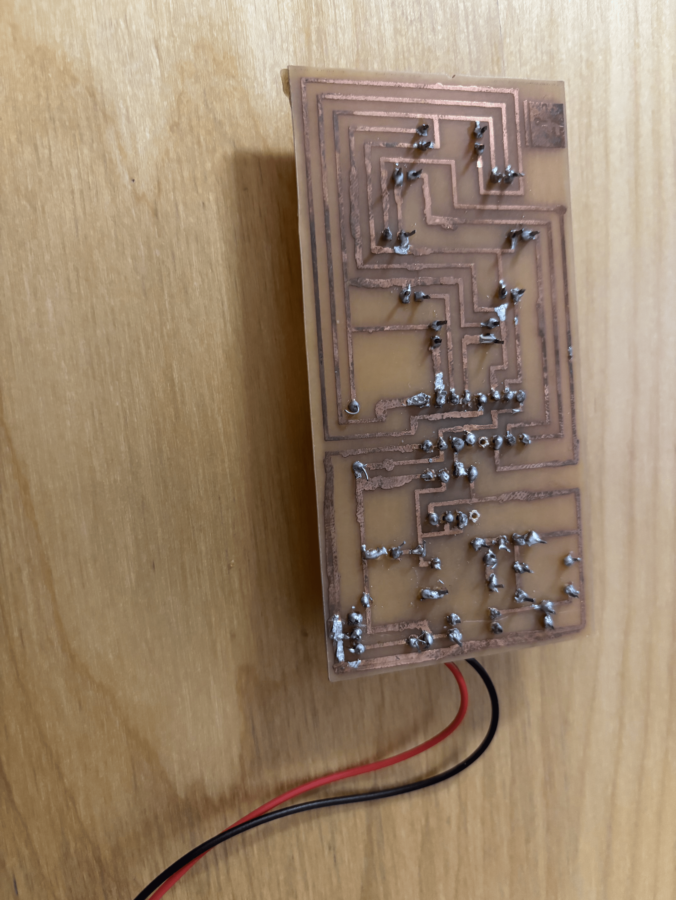

# Handcrafted Electronic Roulette PCB

An analog, microcontroller-free electronic roulette board built using a 555 Timer IC, 4017 Counter IC, chemical copper etching, and precision hand-soldering.

## Demo Video
(https://github.com/user-attachments/assets/42e385ac-9d37-4a83-b3c7-f612fff73042)

## Physical Board Photos

### Top Side (Component Placement)

### Bottom Side (Etched Copper Traces & Soldering)

## Technical & Hardware Overview
* **Schematic & PCB Layout:** Translated a multi-stage electronic circuit schematic into a physical PCB layout using Fritzing, routing copper trace paths to connect ICs, resistors, and LEDs.
* **Fabrication:** Fabricated a fully custom printed circuit board via chemical copper etching, drilling component through-holes, and precision hand-soldering discrete components.
* **Circuit Logic:** Driven purely by analog integrated circuits (**555 Timer** for clock pulse generation and **4017 Decade Counter** for sequential LED illumination).
* **Hardware Debugging:** Tested circuit continuity, and signal paths using a digital multimeter to diagnose short circuits and fix solder bridges and polarity issues.

## Project Files
* `Roulette-finishedprototype_etch_copper_bottom.png`: Exported copper trace routing layout mask used during chemical etching.
